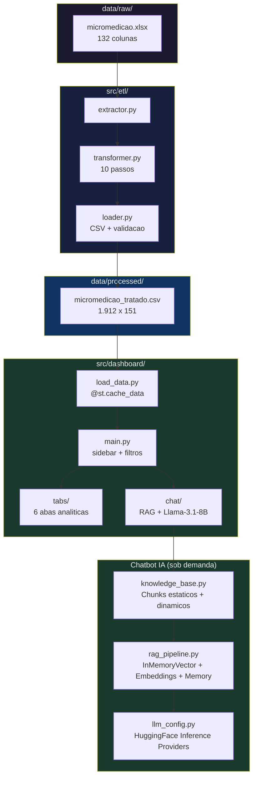
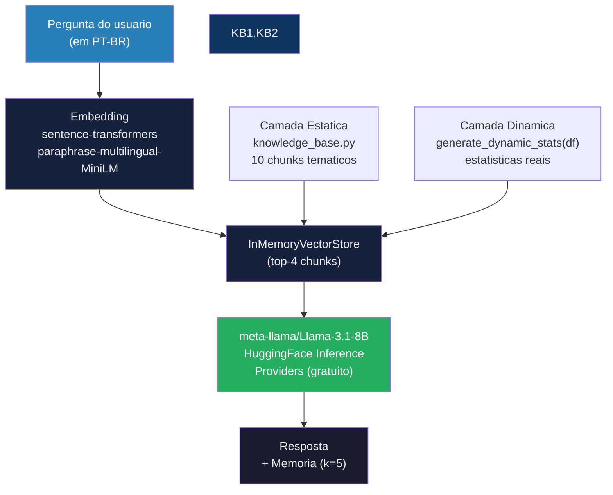
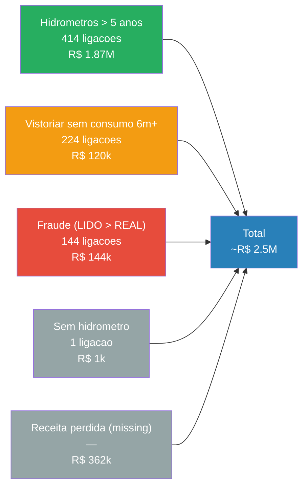

# sanova-micromedicao-dashboard

**Dashboard de Analise Comercial de Micromedicao** — Streamlit dashboard for commercial analysis of sanitation micro-metering data.

> Teste pratico para Analista de Dados | SANOVA — Inovacao em Saneamento

---

## Sobre Este Projeto

Este trabalho demonstra capacidade de engenharia de dados e analise de sistemas comerciais de saneamento, com foco em **micromedicao, deteccao de anomalias e recuperacao de receita**.

A SANOVA (sanova.com.br) atua ha quase 15 anos no mercado nacional de saneamento, com mais de 150 clientes impactados. Este projeto aplica esses conhecimentos em um estudo real de dados comerciais de uma concessionaria de saneamento — **1.912 ligacoes** ao longo de **13 meses**.

---

## O que Este Dashboard Faz

O dashboard responde perguntas estrategicas sobre o sistema de abastecimento:

| Pergunta | Aba |
|---|---|
| Quais ligacoes geram/pagam receita? | Visao Geral |
| Onde ha sinais de fraude? | Anomalias & Fraudes |
| Quanto custa o consumo zero? | Consumo Zero |
| Quais hidrometros precisam troca? | Hidrometros |
| Quanto podemos recuperar de receita? | Recuperacao de Receita |
| Os dados sao confiaveis? | Qualidade de Dados |
| Perguntas em linguagem natural? | Chatbot IA |

---

## Arquitetura do Sistema




---

## Estrutura do Projeto

```
dashboard-sanova/
├── run.py
├── pyproject.toml
├── .env.example / .env.local
├── src/
│   ├── dashboard/
│   │   ├── main.py              # Entry point
│   │   ├── load_data.py         # @st.cache_data
│   │   ├── config.py            # Premissas
│   │   ├── utils.py             # Helpers
│   │   ├── chat/                # Chatbot IA
│   │   │   ├── llm_config.py    # HuggingFace LLM
│   │   │   ├── rag_pipeline.py  # InMemoryVector + embeddings
│   │   │   └── knowledge_base.py # Base de conhecimento
│   │   └── tabs/
│   │       ├── overview.py       # KPIs + IQD
│   │       ├── anomalies.py      # Fraudes + outliers
│   │       ├── zero_consumption.py
│   │       ├── meters.py
│   │       ├── recovery.py
│   │       └── data_quality.py
│   └── etl/
│       ├── extractor.py
│       ├── transformer.py        # 10 passos
│       ├── loader.py
│       └── run_pipeline.py
├── data/
│   ├── raw/micromedicao.xlsx
│   ├── processed/micromedicao_tratado.csv
│   └── stage/validation_log.json
└── tests/                       # 34 testes pytest
```

---

## ETL — Pipeline de Engenharia de Dados

```mermaid
flowchart LR
    XLSX["Excel Fonte\n132 cols"] --> N1["1. Normalizar\nuppercase + acentos"]
    N1 --> N2["2. Decimal BR\nvirgula -> ponto"]
    N2 --> N3["3. Converter\ndatas DD/MM/AAAA"]
    N3 --> N4["4. Missing cadastral\n82 ligacoes"]
    N4 --> N5["5. Missing economias\nfillna(0)"]
    N5 --> N6["6. Missing volumes\nflag preservada"]
    N6 --> N7["7. Missing valores\n0 para nao-ativos"]
    N7 --> N8["8. Outliers\nP99 + flag"]
    N8 --> N9["9. Enriquecimento\n14 cols calculadas"]
    N9 --> N10["10. Validar\nQ001-Q006"]
    N10 --> CSV["CSV Tratado\n1.912 x 151"]

    style XLSX fill:#e74c3c,color:#fff
    style N1,N2,N3,N4,N5,N6,N7,N8,N9 fill:#2980B9,color:#fff
    style N10 fill:#f39c12,color:#fff
    style CSV fill:#27AE60,color:#fff
```



---

## Chatbot IA Generativa com RAG

Assistente de perguntas em linguagem natural sobre os dados de micromedicao. Integrado na sidebar do dashboard.



### Configuracao do Chatbot

1. Crie conta em [huggingface.co](https://huggingface.co)
2. Gere um Access Token (tipo **Fine-grained**, permissoes **Inference > Make calls to serverless Inference API**)
3. Edite `.env.local`:

```bash
HF_TOKEN=hf_your_token_here
```

> Custo: gratuito — $0.10/mes em credits HF (centenas de perguntas).

---

## Oportunidades de Recuperacao de Receita



---

## Abas do Dashboard

| Aba | Conteudo | Principais Graficos |
|---|---|---|
| **Visao Geral** | KPIs + IQD + distribuicao | Area temporal, pizza, barras |
| **Anomalias & Fraudes** | Deteccao LIDO > REAL, outliers | Scatter, barras, tabela priorizada |
| **Consumo Zero** | Perda por tarifa minima | Histograma, barras |
| **Hidrometros** | Tipo, marca, idade, substituicao | Pizza, barras, tabela por idade |
| **Recuperacao de Receita** | Potencial por acao, waterfall | Waterfall, gauge, tabela priorizada |
| **Qualidade de Dados** | IQD, missing, inconsistencias | Heatmap, tabela |

---

## Stack Tecnologica

| Camada | Tecnologia |
|---|---|
| **Framework** | Python 3.10+ · Streamlit |
| **Dados** | Pandas · NumPy · Plotly |
| **IA / LLM** | LangChain · HuggingFace Inference Providers · Llama-3.1-8B-Instruct |
| **Embeddings** | sentence-transformers · `paraphrase-multilingual-MiniLM-L12-v2` |
| **Vector Store** | InMemoryVectorStore (langchain-community) |
| **Gestão** | Poetry · Pytest (34 testes) |

---

## Como Executar

```bash
# 1. Instalar dependencias
poetry install

# 2. Pipeline ETL (so se precisar reprocessar)
python src/etl/run_pipeline.py

# 3. Chatbot (opcional): configurar HF_TOKEN em .env.local
#   Veja secao "Chatbot IA Generativa com RAG" acima.

# 4. Abrir dashboard
python run.py
```

Dashboard disponible em `http://localhost:8501`.

---

## Premissas Tecnicas

| Premissa | Valor | Fonte |
|---|---|---|
| Tarifa minima | R$ 89,03 | Menor VALOR_TOTAL observado |
| Custo unitario da agua | R$ 10/m³ | Estimativa |
| Fator de submedição (> 5 anos) | 15% | ABNT NBR 15538 |
| Anomalia de leitura | LIDO > REAL + 1 m³ | Critério de fraude |
| Outlier extremo | P99 | Metodo estatistico |

---

*Desenvolvido como teste pratico para Analista de Dados — SANOVA (sanova.com.br) | Palhoca/SC | 2026*
