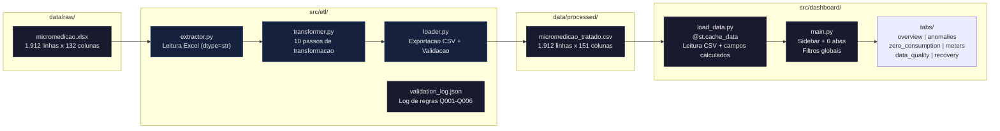
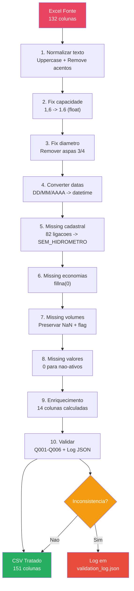
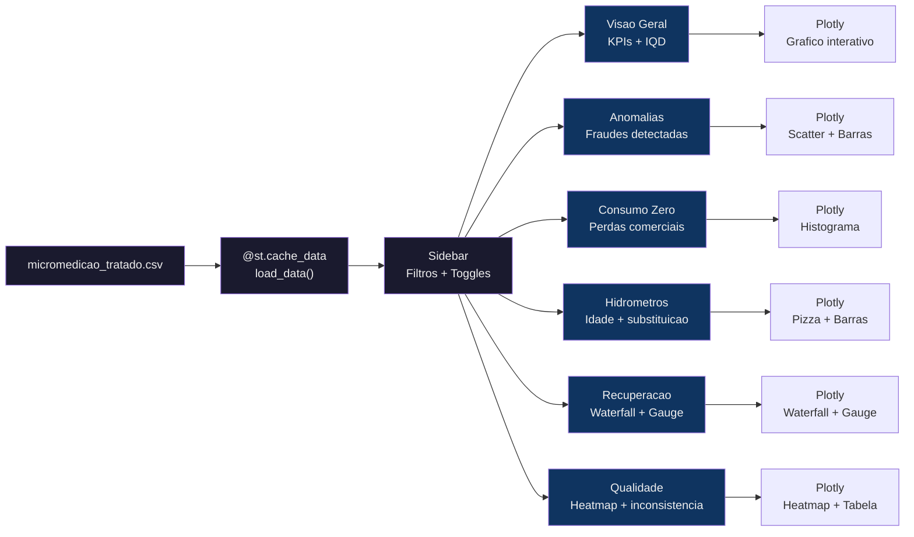

# sanova-micromedicao-dashboard

**Dashboard de Analise Comercial de Micromedicao** — Streamlit dashboard for commercial analysis of sanitation micro-metering data.

> Teste pratico para Analista de Dados | SANOVA — Inovacao em Saneamento

---

## Sobre Este Projeto

Este trabalho demonstra capacidade de engenharia de dados e analise de sistemas comerciais de saneamento, com foco em **micromedicao, deteccao de anomalias e recuperacao de receita**.

A SANOVA (sanova.com.br) atua ha quase 15 anos no mercado nacional de saneamento, com mais de 150 clientes impactados. Entre seus principais servicos estao: gerenciamento de perdas de agua, modelagem hidraulica, gestao de cidades inteligentes e cadastro tecnico de redes. Este projeto aplica esses conhecimentos em um estudo real de dados comerciais de uma concessionaria de saneamento.

---

## O que Este Dashboard Faz

O dashboard analisa **1.912 ligacoes** de um sistema de abastecimento de agua ao longo de **13 meses**, respondendo as seguintes perguntas estrategicas:

- **Quais ligacoes estao gerando receita e quais estao perdendo?** (Visão Geral)
- **Onde ha sinais de fraude ou adulteracao de hidrômetros?** (Anomalias & Fraudes)
- **Quantas ligacoes estao com consumo zero — e quanto isso custa?** (Consumo Zero)
- **Quais hidrômetros estao velhos demais e precisam ser trocados?** (Hidrômetros)
- **Quanto dinheiro a concessionaria pode recuperar com acoes corretivas?** (Recuperacao de Receita)
- **A qualidade dos dados permite tomada de decisao confiavel?** (Qualidade de Dados)

---

## Estrutura do Projeto

```
dashboard-sanova/
├── run.py                    # Executar dashboard: python run.py
├── pyproject.toml             # Poetry — dependencias
├── src/
│   ├── dashboard/            # Aplicacao Streamlit
│   │   ├── main.py            # Entry point com 6 abas
│   │   ├── load_data.py       # Leitura + cache de dados
│   │   ├── config.py           # Premissas e configuracoes
│   │   ├── utils.py            # Funcoes auxiliares
│   │   └── tabs/              # 6 modulos de analise
│   └── etl/                   # Pipeline de engenharia de dados
│       ├── extractor.py       # Leitura Excel
│       ├── transformer.py     # Limpeza e enriquecimento
│       ├── loader.py          # Exportacao CSV
│       └── run_pipeline.py    # Orquestrador do pipeline
├── data/
│   ├── raw/micromedicao.xlsx                  # Fonte original
│   ├── processed/micromedicao_tratado.csv      # Dados tratados
│   └── stage/validation_log.json               # Log de validacao
└── tests/                    # 34 testes automatizados
```

---

## Fluxo de Dados do Projeto



### Detalhamento do Pipeline ETL



### Fluxo de Dados no Dashboard



---

## Engenharia de Dados Aplicada

O pipeline ETL (Excel -> Tratamento -> CSV) foi construido para garantir integridade dos dados antes da analise:

| Etapa | Tratamento |
|---|---|
| **Normalizacao de texto** | Uppercase, remocao de acentos, strip |
| **Correcao de formatos** | Decimal brasileiro (virgula->ponto), datas BR (DD/MM/AAAA) |
| **Tratamento de missing** | 82 ligacoes sem hidrometro classificadas; missing progressivo preservado com flags |
| **Deteccao de outliers** | Volumes > 900.000 m³ identificados como erros de digitacao |
| **Enriquecimento** | 14 colunas calculadas: flags de anomalia, score de prioridade, idade do hidrometro |

---

## Resultados da Analise

### Oportunidades de Recuperacao de Receita

| Acao | Ligacoes | Receita Potencial (12m) |
|---|---|---|
| Substituir hidrometros > 5 anos (submedição 15%) | 414 | R$ 1.869.000 |
| Vistoriar ligacoes com 6+ meses sem consumo | 224 | R$ 119.655 |
| Fiscalizar divergencias LIDO > REAL (fraude) | 144 | R$ 144.000 |
| Instalar hidrometro em ligacao ativa sem medidor | 1 | R$ 1.068 |
| Receita perdida por dados ausentes | — | R$ 362.146 |
| **Total** | | **R$ 2.495.869** |

> Estimativas baseadas em premissas conservadoras: tarifa minima de R$ 89,03, custo de R$ 10/m³ e fator de submedição de 15% (referencia ABNT NBR 15538).

---

## Abas do Dashboard

O dashboard e composto por 6 abas interativas, todas conectadas aos filtros globais da sidebar (Categoria, Situacao da Ligacao, Marca do Hidrometro).

---

### 1. Visao Geral

Painel executivo com os principais indicadores do sistema de micromedicao. Exibe KPIs em tempo real, um grafico de area com a evolucao do faturamento ao longo dos 13 meses, e heatmaps com o consumo medio por categoria ao longo do tempo. Inclui tambem a distribuicao por categoria (pizza) e por situacao da ligacao (barras horizontais com cores semanticas: verde para ativas, vermelho para cortadas, laranja para nao informadas). O Indice de Qualidade de Dados (IQD) e exibido com delta colorido — verde acima de 90%, laranja entre 70-90%, vermelho abaixo de 70%.

---

### 2. Anomalias & Fraudes

Aba focada na deteccao de anomalias que podem indicar fraude ou falhas de medicao. Cruza tres fontes de evidencia: a divergencia entre volume lido e volume real (LIDO > REAL sugere adulteracao), a ausencia de hidrometro em ligacoes ativas, e outliers estatisticos (volumes acima do percentil 99). Um scatter plot interativo permite visualizar a relacao entre volume lido e real com opcao de filtrar outliers. Um grafico de barras mostra a contagem por tipo de anomalia. Casos prioritarios sao ordenados por score de prioridade e exibidos em tabela paginada.

---

### 3. Consumo Zero

Analise de ligacoes que registram consumo zero ao longo de um ou mais meses. Contabiliza a receita perdida pela tarifa minima aplicada a cada mes sem medicao em ligacoes ativas. Exibe um histograma com a distribuicao de meses com consumo zero e um grafico de barras com a quebra por categoria. Casos criticos (3+ meses consecutivos ou alternados sem consumo) sao listados em tabela com receita perdida estimada por ligacao. O filtro global permite segmentar por situacao — por exemplo, restringir a ligacoes ATIVA para focar em perdas comerciais.

---

### 4. Hidrometros

Inventario completo dos equipamentos de medicao. Apresenta a distribuicao por tipo (Unijato, Mecanico, etc.), por marca ( anonimizada como MARCA A-F), por classe metrologica (ABNT) e a distribuicao etaria dos equipamentos. A idade e calculada a partir da data de instalacao. Hidrometros com mais de 5 anos sao marcados como candidatos a substituicao, com receita potencial de submedição estimada em 15% ao ano (referencia ABNT NBR 15538). Tabela paginada lista todos os candidatos ordenados por idade, com valor faturado e receita potencial acumulada.

---

### 5. Recuperacao de Receita

Painel estrategico que quantifica o potencial de recuperacao de receita por tipo de acao. Define quatro eixos de acao: (1) instalar hidrometro em ligacoes ativas sem medidor, (2) fiscalizar ligacoes com divergencia lido/real significativa, (3) vistorias em ligacoes com 6+ meses sem consumo, e (4) programa de substituicao de hidrometros velhos. Cada acao exibe quantidade de ligacoes afetadas e receita potencial em 12 meses. Um waterfall chart mostra o impacto acumulado de cada acao sobre o faturamento atual, e um gauge indica o potencial de recuperacao em relacao ao faturamento. A tabela de acoes priorizadas e colorizada por nivel: Alta (vermelho), Media (laranja), Baixa (verde).

---

### 6. Qualidade de Dados

Monitoramento da integridade do dataset. Calcula o Indice de Qualidade de Dados (IQD) como percentual de registros completos. Heatmaps mostram a evolucao do missing data ao longo dos 13 meses — por coluna (volume, valor) e por mes, revelando se ha um padrao progressivo de ausencia de dados. Tabela de inconsistencias classifica os problemas por tipo e impacto, incluindo: divergencias LIDO > REAL, outliers extremos, ligacoes ativas sem hidrometro, e meses com leitura ausente. As 10 colunas com maior indice de missing sao listadas para priorizacao de correcao cadastral.

---

## Stack Tecnologica

| Tecnologia | Uso |
|---|---|
| **Python 3.10+** | Linguagem base |
| **Streamlit** | Dashboard interativo |
| **Pandas** | Processamento e analise de dados |
| **Plotly** | Visualizacoes interativas |
| **Poetry** | Gestao de dependencias |
| **Pytest** | Testes automatizados (34 testes) |

---

## Como Executar

### 1. Instalar dependencias

```bash
cd E:\SANOVA\dashboard-sanova
poetry install
```

### 2. Executar pipeline ETL (so se precisar reprocessar)

```bash
python src/etl/run_pipeline.py
```

### 3. Abrir o dashboard

```bash
python run.py
```

O dashboard abrira no navegador em `http://localhost:8501`.

---

## Premissas Tecnicas Adotadas

| Premissa | Valor | Fonte |
|---|---|---|
| Tarifa minima | R$ 89,03 | Menor VALOR_TOTAL observado (consumo ~10 m³) |
| Custo unitario da agua | R$ 10/m³ | Estimativa para calculo de receita perdida |
| Fator de submedição (> 5 anos) | 15% | ABNT NBR 15538 e literatura tecnica |
| Anomalia de leitura | LIDO > REAL + 1 m³ | Critério de fraude/adulteracao |
| Outlier extremo | VOLUME_LIDO > percentil 99 | Metodo estatistico |

---

## Competencias Demonstradas

- **Engenharia de dados**: pipeline ETL com tratamento de missing, normalizacao de formato e enriquecimento de dados
- **Analise exploratoria**: diagnostico de 23 problemas de qualidade, outliers e inconsistencias
- **Visualizacao de dados**: dashboards interativos com KPIs executivos, graficos de series temporais, heatmaps e waterfall charts
- **Python**: orientacao a objetos, modularizacao, testes automatizados
- **Dominio de saneamento**: glossary tecnico (matricula, volume lido/real/faturado, classes metrologicas, tarifa minima)

---

*Desenvolvido como teste pratico para Analista de Dados — SANOVA (sanova.com.br)*
*Palhoca/SC | 2026*