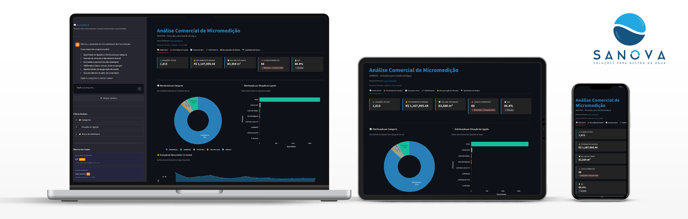
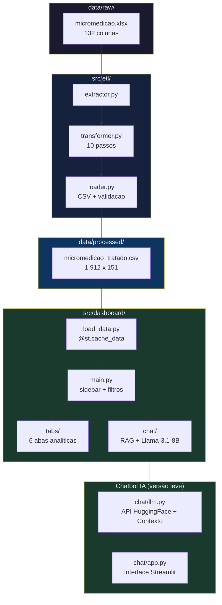
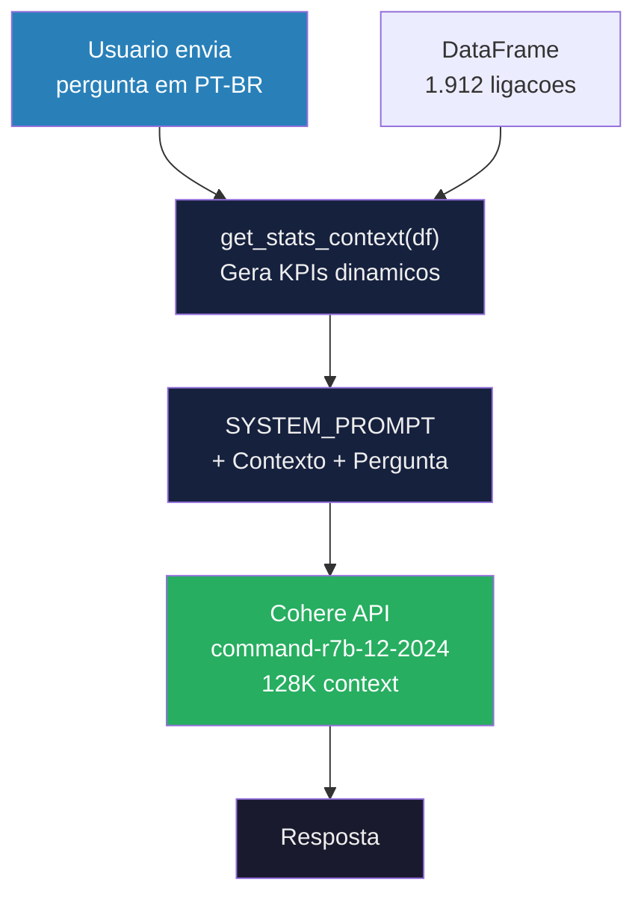
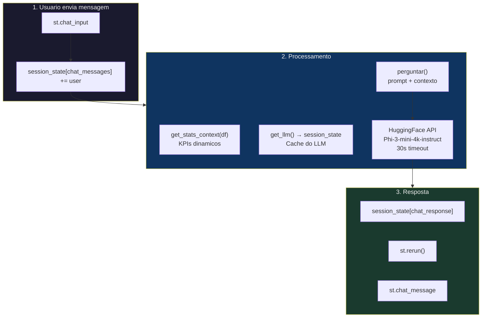
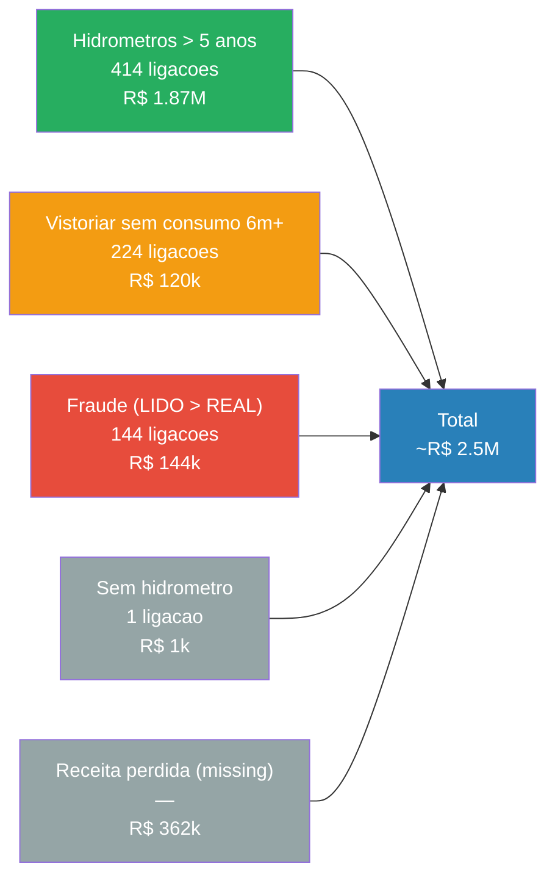

# SANOVA – Soluções para Gestão da Água



**Análise Comercial de Micromedição** — Streamlit dashboard for commercial analysis of sanitation micro-metering data.

> Desenvolvido por [Lucas Cavalcante](https://cavalcanteprofissional.github.io/portfolio/) | Teste prático para Analista de Dados | SANOVA — Inovação em Saneamento

---

## Sobre Este Projeto

Este trabalho demonstra capacidade de engenharia de dados e analise de sistemas comerciais de saneamento, com foco em **micromedicao, deteccao de anomalias e recuperacao de receita**.

A SANOVA (sanova.com.br) atua ha quase 15 anos no mercado nacional de saneamento, com mais de 150 clientes impactados. Este projeto aplica esses conhecimentos em um estudo real de dados comerciais de uma concessionaria de saneamento — **1.912 ligacoes** ao longo de **13 meses**.

---

## O que Este Dashboard Faz

O dashboard responde perguntas estrategicas sobre o sistema de abastecimento:

| Pergunta | Aba |
|---|---|
| Quais ligacoes geram/pagam receita? | Visao Geral |
| Onde ha sinais de fraude? | Anomalias & Fraudes |
| Quanto custa o consumo zero? | Consumo Zero |
| Quais hidrometros precisam troca? | Hidrometros |
| Quanto podemos recuperar de receita? | Recuperacao de Receita |
| Os dados sao confiaveis? | Qualidade de Dados |
| Perguntas em linguagem natural? | Chatbot IA |

---

## Arquitetura do Sistema




---

## Estrutura do Projeto

```
dashboard-sanova/
├── pyproject.toml
├── .env.example / .env.local
├── src/
│   ├── dashboard/
│   │   ├── main.py              # Entry point
│   │   ├── load_data.py         # @st.cache_data
│   │   ├── config.py            # Premissas
│   │   ├── utils.py             # Helpers
│   │   ├── chat/                # Chatbot IA (versão leve)
│   │   │   ├── __init__.py
│   │   │   ├── llm.py           # HuggingFace API + contexto
│   │   │   └── app.py           # Interface de chat
│   │   └── tabs/
│   │       ├── chat.py          # Wrapper do chatbot
│   │       ├── overview.py       # KPIs + IQD
│   │       ├── anomalies.py      # Fraudes + outliers
│   │       ├── zero_consumption.py
│   │       ├── meters.py
│   │       ├── recovery.py
│   │       └── data_quality.py
│   └── etl/
│       ├── extractor.py
│       ├── transformer.py        # 10 passos
│       ├── loader.py
│       └── run_pipeline.py
├── data/
│   ├── raw/micromedicao.xlsx
│   ├── processed/micromedicao_tratado.csv
│   └── stage/validation_log.json
└── tests/                       # 34 testes pytest
```

---

## ETL — Pipeline de Engenharia de Dados

```mermaid
flowchart LR
    XLSX["Excel Fonte\n132 cols"] --> N1["1. Normalizar\nuppercase + acentos"]
    N1 --> N2["2. Decimal BR\nvirgula -> ponto"]
    N2 --> N3["3. Converter\ndatas DD/MM/AAAA"]
    N3 --> N4["4. Missing cadastral\n82 ligacoes"]
    N4 --> N5["5. Missing economias\nfillna(0)"]
    N5 --> N6["6. Missing volumes\nflag preservada"]
    N6 --> N7["7. Missing valores\n0 para nao-ativos"]
    N7 --> N8["8. Outliers\nP99 + flag"]
    N8 --> N9["9. Enriquecimento\n14 cols calculadas"]
    N9 --> N10["10. Validar\nQ001-Q006"]
    N10 --> CSV["CSV Tratado\n1.912 x 151"]

    style XLSX fill:#e74c3c,color:#fff
    style N1,N2,N3,N4,N5,N6,N7,N8,N9 fill:#2980B9,color:#fff
    style N10 fill:#f39c12,color:#fff
    style CSV fill:#27AE60,color:#fff
```



---

## Chatbot IA — Versão Leve (Prompt Engineering)

Assistente de perguntas em linguagem natural sobre os dados de micromedicao. Integrado na sidebar do dashboard.

> **Nota (13/05/2026):** O chatbot foi reimplementado em versão leve para evitar travamentos. A versão anterior usava RAG com embeddings via API que causava lentidão extrema.

### Arquitetura Nova (Sem RAG)



### Diferenças: Versão Pesada vs Leve

| Componente | Antes (RAG) | Depois (Leve) |
|------------|--------------|--------------|
| Provider | HuggingFace | **Cohere** |
| Modelo | Phi-3-mini (problemas) | **command-r7b-12-2024** |
| API | InferenceClient (lento) | **Cohere Client** |
| Embeddings | sentence-transformers (API) | **Removido** |
| Vector Store | FAISS/InMemoryVectorStore | **Removido** |

**Resultado:** ~66 packages no lock (antes: 126+), sem LangChain, sem travamentos.

### Contexto Dinâmico dos Dados

O chatbot inclui KPIs reais do DataFrame injetados no prompt:

```python
def get_stats_context(df):
    return f"""
    📊 ESTATÍSTICAS ATUAIS:
    - Total de ligações: {len(df)}
    - Ligações ativas: {ativas}
    - Faturamento mensal: R$ {fat_mensal:,.2f}
    - Volume total: {vol_total:,.0f} m³
    - Anomalias (LIDO > REAL): {anomalias} casos
    - Consumo zero ativo: {consumo_zero} casos
    - Hidrômetros > 5 anos: {hidro_velhos} unidades
    - Por categoria: {categorias}
    """
```

### Configuração

1. Crie conta em [cohere.com](https://cohere.com) (gratuito)
2. Gere uma API Key em https://dashboard.cohere.com/
3. Edite `.env.local`:

```bash
COHERE_API_KEY=seu_token_aqui
```

> Custo: gratuito — plano trial com chamadas disponíveis.

### Fluxo de Execução



### Features

**Cache via session_state:**
- `session_state["chat_llm"]` — instância do LLM (uma única vez por sessão)

**Fallback FAQ:**
- 9 respostas predefinidas para tópicos conhecidos
- Ativado automaticamente quando API falha/timeout

**Streamlit Cloud:**
- `COHERE_API_KEY` configurado nos Secrets do app
- Fallback automático: env var → .env.local → st.secrets

---

## Oportunidades de Recuperacao de Receita



---

## Abas do Dashboard

| Aba | Conteudo | Principais Graficos |
|---|---|---|
| **Visao Geral** | KPIs + IQD + distribuicao | Area temporal, pizza, barras |
| **Anomalias & Fraudes** | Deteccao LIDO > REAL, outliers | Scatter, barras, tabela priorizada |
| **Consumo Zero** | Perda por tarifa minima | Histograma, barras |
| **Hidrometros** | Tipo, marca, idade, substituicao | Pizza, barras, tabela por idade |
| **Recuperacao de Receita** | Potencial por acao, waterfall | Waterfall, gauge, tabela priorizada |
| **Qualidade de Dados** | IQD, missing, inconsistencias | Heatmap, tabela |

---

## Stack Tecnologica

| Camada | Tecnologia |
|---|---|
| **Framework** | Python 3.10+ · Streamlit |
| **Dados** | Pandas · NumPy · Plotly |
| **Chatbot** | Cohere API · command-r7b-12-2024 (128K context) · Prompt Engineering |
| **Gestão** | Poetry · Pytest (34 testes) |

> **Nota:** Chatbot sem LangChain, sem embeddings, sem vector store — arquitetura leve para evitar travamentos.

---

## Melhorias UI/UX (Maio/2026)

O dashboard passou por uma reestruturação visual completa com foco em **dark mode** e **cores semânticas**:

### Paleta de Cores

| Status | Cor | Uso |
|--------|-----|-----|
| INFO | `#2980B9` | Azul — Informativo |
| ATIVO | `#1ABC9C` | Verde água — Ligações ativas |
| SUCESSO | `#27AE60` | Verde — Dentro do esperado |
| ALERTA | `#F39C12` | Laranja — Atenção |
| CRÍTICO | `#E74C3C` | Vermelho — Ação necessária |
| NEUTRO | `#95A5A6` | Cinza — Inativos |

### Componentes Melhorados

- **KPI Cards**: Borda colorida por status, hover effect, container flex
- **Gráficos**: Cores semânticas (não automáticas), tooltips informativos
- **Tabelas**: Linhas coloridas por criticidade (vermelho = crítico, laranja = atenção)
- **Sidebar**: Seções organizadas, contadores com badges coloridos
- **Heatmaps**: Escala RdYlGn_r para destacar valores altos (vermelho)

### Diferença entre Métricas

| Local | Nome | Componentes |
|-------|------|-------------|
| **Sidebar** | Casos técnicos | Anomalia de leitura + Outliers extremos |
| **Overview** | Casos comerciais | Anomalia de leitura + Consumo Zero |

> Essa distinção foi criada para separar problemas técnicos (dados inconsistentes) de problemas comerciais (consumo anormal).

---

## Como Executar

### Local (Poetry)

```bash
# 1. Instalar dependencias
poetry install

# 2. Pipeline ETL (so se precisar reprocessar)
python src/etl/run_pipeline.py

# 3. Chatbot (opcional): configurar COHERE_API_KEY em .env.local
#   Veja secao "Chatbot IA Generativa com RAG" acima.

# 4. Abrir dashboard
poetry run streamlit run src/dashboard/main.py
```

Dashboard disponible em `http://localhost:8501`.

### Codespaces / Venv Externo

```bash
# Ativar ambiente virtual primeiro
source .venv/bin/activate

# Instalar deps (se necessario)
pip install poetry
poetry install

# Executar
streamlit run src/dashboard/main.py
```

> Se executar sem Poetry/venv ativo, o dashboard ajusta o `sys.path` automaticamente.
> O `HF_TOKEN` deve estar em `.env.local` para uso local, ou nos Secrets do Streamlit Cloud para deploy.

---

## Premissas Técnicas e Metodologia

| Premissa | Valor | Fonte |
|---|---|---|
| Tarifa mínima | R$ 89,03 | Menor VALOR_TOTAL observado (~10m³) — validar com concessionária |
| Custo unitário água | R$ 10/m³ | Estimativa — custo operacional médio |
| Fator de submedição (> 5 anos) | 15% | ABNT NBR 15538 |
| Anomalia de leitura | LIDO > REAL + 1 m³ | Critério empírico |
| Consumo crônico zero | ≥ 6 meses | Padrão do setor |
| Score de Prioridade | Pesos empíricos | Ver detalhe abaixo |

### Score de Prioridade (Metodologia)

O score é calculado com pesos definidos empiricamente:

| Flag | Peso | Justificativa |
|------|------|----------------|
| Anomalia de leitura | 50 | Alto impacto em receita |
| Sem hidrômetro (ativa) | 40 | Sem medição = sem controle |
| Consumo zero ativo | 30 | Possível perda de receita |
| 3+ meses consumo zero | 20 | Padrão crônico |
| Hidrômetro > 5 anos | 10 | Submedição gradual |

> ⚠️ *Os pesos são ajustáveis conforme validação de campo. Esta metodologia foi documentada no expander "Premissas e Metodologia" do dashboard.*

### Limitações dos Dados

- Marcas de hidrômetro anonimizadas (A–F) — sem correlação com fabricante
- Endereços não disponíveis — análise geoespacial não aplicável
- Consumidores industriais podem gerar falsos positivos em "consumo implausível"
- Valores de recuperação são estimativas conservadoras

---

**SANOVA – Soluções para Gestão da Água** | [sanova.com.br](https://sanova.com.br)

*Desenvolvido por [Lucas Cavalcante](https://cavalcanteprofissional.github.io/portfolio/) | Palhoça/SC | Maio 2026*
