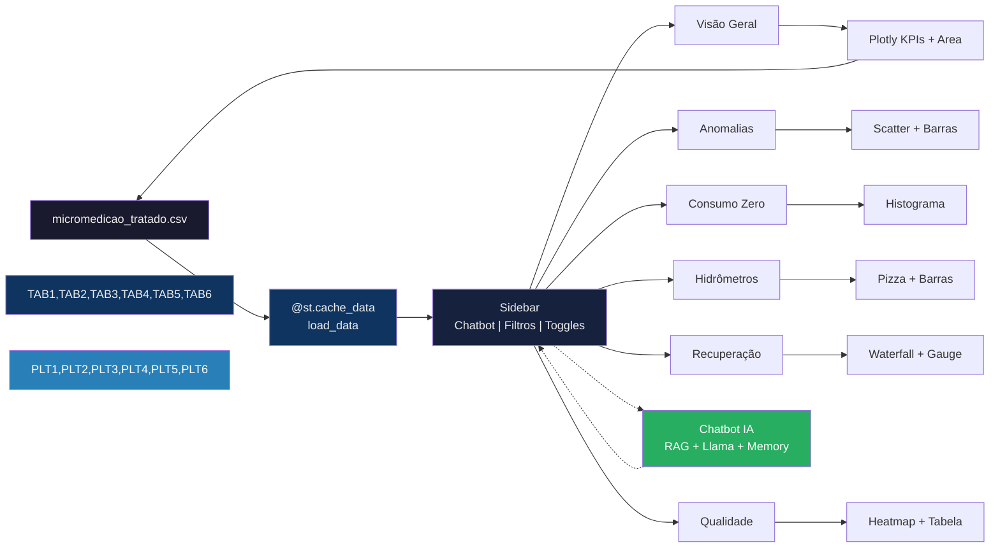
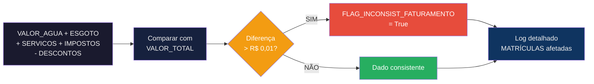
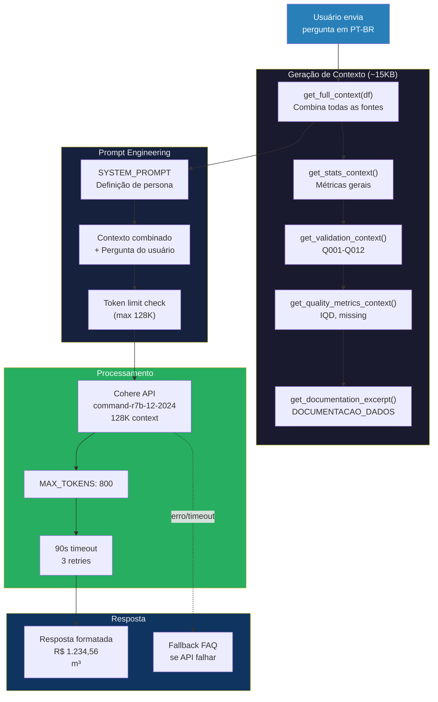
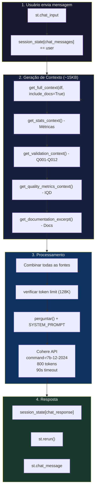

# SANOVA – Soluções para Gestão da Água


**Análise Comercial de Micromedição** — Dashboard para análise comercial de micromedição de saneamento.

> Desenvolvido por [Lucas Cavalcante](https://cavalcanteprofissional.github.io/portfolio/) | Teste prático para Analista de Dados | SANOVA

---

## Sobre Este Projeto

Este trabalho demonstra capacidade de engenharia de dados e análise de sistemas comerciais de saneamento, com foco em **micromedição, detecção de anomalias e recuperação de receita**.

A SANOVA (sanova.com.br) atua há quase 15 anos no mercado nacional de saneamento, com mais de 150 clientes impactados. Este projeto aplica esses conhecimentos em um estudo real de dados comerciais de uma concessionária de saneamento — **1.912 ligações** ao longo de **13 meses**.

---

## O que Este Dashboard Faz

O dashboard responde perguntas estratégicas sobre o sistema de abastecimento:

| Pergunta | Aba |
|---|---|
| Quais ligações geram/pagam receita? | Visão Geral |
| Onde há sinais de fraude? | Anomalias & Fraudes |
| Quanto custa o consumo zero? | Consumo Zero |
| Quais hidrômetros precisam troca? | Hidrômetros |
| Quanto podemos recuperar de receita? | Recuperação de Receita |
| Os dados são confiáveis? | Qualidade de Dados |
| Perguntas em linguagem natural? | Chatbot IA |

---

## Arquitetura do Sistema




---

## Estrutura do Projeto

```
dashboard-sanova/
├── pyproject.toml
├── .env.example / .env.local
├── src/
│   ├── dashboard/
│   │   ├── main.py              # Entry point
│   │   ├── load_data.py         # @st.cache_data
│   │   ├── config.py            # Premissas
│   │   ├── utils.py             # Helpers
│   │   ├── chat/                # Chatbot IA (versão leve)
│   │   │   ├── __init__.py
│   │   │   ├── llm.py           # Cohere API + contexto
│   │   │   └── app.py           # Interface de chat
│   │   └── tabs/
│   │       ├── chat.py          # Wrapper do chatbot
│   │       ├── overview.py      # KPIs + IQD
│   │       ├── anomalies.py     # Fraudes + outliers
│   │       ├── zero_consumption.py
│   │       ├── meters.py
│   │       ├── recovery.py
│   │       └── data_quality.py
│   └── etl/
│       ├── extractor.py
│       ├── transformer.py       # 10 passos
│       ├── loader.py
│       └── run_pipeline.py
├── data/
│   ├── raw/micromedicao.xlsx
│   ├── processed/micromedicao_tratado.csv    # ~170 colunas (flags + validações)
│   └── stage/validation_log.json             # Q001-Q012 detalhado
└── tests/                       # 34 testes pytest
```

---

## ETL — Pipeline de Engenharia de Dados

```mermaid
flowchart LR
    XLSX["Excel Fonte\n132 cols"] --> N1["1. Normalizar\nuppercase + acentos"]
    N1 --> N2["2. Decimal BR\nvírgula -> ponto"]
    N2 --> N3["3. Converter\ndatas DD/MM/AAAA"]
    N3 --> N4["4. Missing cadastral\n82 ligações"]
    N4 --> N5["5. Missing economias\nfillna(0)"]
    N5 --> N6["6. Missing volumes\nflag preservada"]
    N6 --> N7["7. Missing valores\n0 para não-ativos"]
    N7 --> N8["8. Outliers\nP99 + flag"]
    N8 --> N9["9. Enriquecimento\n17 cols calculadas"]
    N9 --> N10["10. Validar\nFaturamento Q003"]
    N10 --> N11["11. Validar\nQ004-Q012"]
    N11 --> N12["12. Salvar + Log\nQ001-Q012"]
    N12 --> CSV["CSV Tratado\n~170 cols"]

    style XLSX fill:#e74c3c,color:#fff
    style N1,N2,N3,N4,N5,N6,N7,N8,N9,N10,N11 fill:#2980B9,color:#fff
    style CSV fill:#27AE60,color:#fff
```



### Validação de Consistência de Faturamento (Q003)

O ETL inclui uma verificação adicional de integridade dos dados de faturamento:



**Colunas criadas pelo ETL:**

| Coluna | Descrição |
|--------|-----------|
| `VALOR_TOTAL_CALCULADO` | Soma: ÁGUA + ESGOTO + SERVIÇOS + IMPOSTOS - DESCONTOS |
| `DIFERENCA_FATURAMENTO` | Diferença absoluta entre TOTAL e CALCULADO |
| `FLAG_INCONSIST_FATURAMENTO` | True se diferença > R$ 0,01 |

**Caso detectado (MATRICULA 1373618-3):**

| Campo | Valor |
|-------|-------|
| VALOR_AGUA | R$ 0,00 |
| VALOR_ESGOTO | R$ 495,40 |
| VALOR_SERVICOS | R$ 0,00 |
| VALOR_IMPOSTOS | R$ 46,81 |
| VALOR_DESCONTOS | R$ 0,00 |
| VALOR_TOTAL (original) | R$ 448,59 |
| VALOR_CALCULADO | R$ 542,21 |
| **DIFERENÇA** | **R$ 93,62** |

> **Causa provável:** Desconto não identificado no campo VALOR_DESCONTOS (deveria ser maior que 0,00).

**No Dashboard:** A aba "Qualidade de Dados" agora exibe um KPI adicional "Inconsist. Faturamento" e uma tabela detalhada com os registros afetados.

---

### Sistema de Validações Q001-Q012

O ETL implementa um sistema completo de validações de qualidade de dados:

```mermaid
flowchart LR
    subgraph VAL["Validações"]
        Q001["Q001\nDuplicatas"]
        Q002["Q002\nDatas futuras"]
        Q003["Q003\nFaturamento"]
        Q004["Q004\nFat < Real"]
        Q005["Q005\nOutliers"]
        Q006["Q006\nNegativos"]
        Q007["Q007\nSem receita"]
        Q008["Q008\nSem categoria"]
        Q009["Q009\nData inválida"]
        Q010["Q010\nZero economias"]
        Q012["Q012\nReal > Lido"]
    end

    VAL --> LOG["validation_log.json"]
    LOG --> DASH["Dashboard\n12 KPIs + Tabelas"]

    style VAL fill:#1a1a2e,color:#eee
    style LOG fill:#16213e,color:#eee
    style DASH fill:#0f3460,color:#eee
```



**Todas as validações implementadas:**

| Código | Validação | Flag Criada | Dashboard |
|--------|-----------|-------------|-----------|
| Q001 | MATRÍCULA duplicada | — | Log |
| Q002 | Data instalação futura | — | Log |
| Q003 | VALOR_TOTAL ≠ soma | `FLAG_INCONSIST_FATURAMENTO` | KPI + Tabela |
| Q004 | VOLUME_FATURADO < VOLUME_REAL | `FLAG_FATURADO_MENOR_REAL` | KPI + Tabela |
| Q005 | Outliers extremos (>P99) | `FLAG_OUTLIER_EXTREMO` | Log |
| Q006 | Volumes/valores negativos | `FLAG_VOLUME_NEGATIVO`, `FLAG_VALOR_NEGATIVO` | KPI |
| Q007 | Ativa sem receita | `FLAG_ATIVA_SEM_RECEITA` | KPI + Tabela |
| Q008 | Sem categoria | `FLAG_SEM_CATEGORIA` | KPI + Tabela |
| Q009 | Data inválida | `FLAG_DATA_INVALIDA` | KPI |
| Q010 | Zero economias | `FLAG_ZERO_ECONOMIAS` | KPI |
| Q012 | REAL > LIDO | `FLAG_REAL_MAIOR_LIDO` | KPI + Tabela |

---

## Chatbot IA — Versão Leve (Prompt Engineering)

Assistente de perguntas em linguagem natural sobre os dados de micromedição. Integrado na barra lateral do dashboard.

> **Nota (15/05/2026):** O chatbot agora inclui contexto rico com validações Q001-Q012, métricas de qualidade e documentação técnica.

### Arquitetura do Chatbot com Contexto Aprimorado



### Fontes de Contexto do Chatbot

| Função | Descrição | Tamanho |
|--------|------------|---------|
| `get_stats_context()` | Ligações, faturamento, anomalias, categorias | ~500 chars |
| `get_validation_context()` | Tabela Q001-Q012 formatada | ~1.500 chars |
| `get_quality_metrics_context()` | IQD, missing, completude | ~600 chars |
| `get_documentation_excerpt()` | DOCUMENTACAO_DADOS.md | ~3.000 chars |
| `get_full_context()` | **Combina todas as anteriores** | **~15.000 chars** |

### Exemplo de Contexto Gerado

```
📊 ESTATÍSTICAS ATUAIS:
- Total de ligações: 1.912
- Ligações ativas: 1.815 (94,9%)
- Faturamento mensal: R$ 1.167.995,44

🔍 VALIDAÇÕES (Q001-Q012):
| Código | Verificação | Qtd | Status |
|--------|-------------|-----|--------|
| Q003 | Inconsistência faturamento | 1 | ⚠️ |
| Q005 | Outliers extremos | 19 | ⚠️ |
| Q008 | Sem categoria | 17 | ⚠️ |
| Q009 | Data inválida | 82 | ⚠️ |

📈 QUALIDADE DE DADOS:
- IQD: 88,4%
- Registros completos: 1.756/1.912

📚 DOCUMENTAÇÃO:
- GLOSSÁRIO: MATRICULA, VOLUME_LIDO, VOLUME_REAL, etc.
- CATEGORIAS: Residencial (87%), Comercial (7,5%), Industrial (4,3%)
- HIDRÔMETROS: Unijato (72,6%), Multijato (7,3%), Ultrassônico (3,3%)
- PREMISSAS: Tarifa mínima R$ 89,03, Submedição 15%
```

### Arquitetura Nova (Sem RAG)


### Diferenças: Versão Pesada vs Leve

| Componente | Antes (RAG) | Depois (Leve) |
|------------|--------------|--------------|
| Provider | HuggingFace | **Cohere** |
| Modelo | Phi-3-mini (problemas) | **command-r7b-12-2024** |
| API | InferenceClient (lento) | **Cohere Client** |
| Embeddings | sentence-transformers (API) | **Removido** |
| Vector Store | FAISS/InMemoryVectorStore | **Removido** |

**Resultado:** ~66 packages no lock (antes: 126+), sem LangChain, sem travamentos.

**Fontes de Contexto:**

| Função | Conteúdo | Tamanho |
|--------|----------|---------|
| `get_stats_context()` | Ligações, faturamento, anomalias, categorias | ~500 caracteres |
| `get_validation_context()` | Tabela Q001-Q012 com status | ~1.500 caracteres |
| `get_quality_metrics_context()` | IQD, missing, completude | ~600 caracteres |
| `get_documentation_excerpt()` | Glossário, tipos hidrômetro, premissas | ~3.000 caracteres |
| `get_full_context()` | **Combinação de todas as anteriores** | **~15.000 caracteres** |

**Exemplo de contexto gerado:**

```
📊 ESTATÍSTICAS ATUAIS:
- Total de ligações: 1.912
- Ligações ativas: 1.815 (94,9%)
- Faturamento mensal: R$ 1.167.995,44

🔍 VALIDAÇÕES (Q001-Q012):
| Q003 | Inconsistência faturamento | 1 | ⚠️ |
| Q005 | Outliers extremos | 19 | ⚠️ |
...

📈 QUALIDADE DE DADOS:
- IQD: 88,4%
- Registros completos: 1.756 / 1.912

📚 DOCUMENTAÇÃO:
- Glossário, categorias, tipos de hidrômetro...
```

### Configuração

1. Crie conta em [cohere.com](https://cohere.com) (gratuito)
2. Gere uma API Key em https://dashboard.cohere.com/
3. Edite `.env.local`:

```bash
COHERE_API_KEY=seu_token_aqui
```

> Custo: gratuito — plano trial com chamadas disponíveis.

### Fluxo de Execução



### Recursos

**Cache via session_state:**
- `session_state["chat_llm"]` — instância do LLM (uma única vez por sessão)

**Fallback FAQ:**
- 9 respostas predefinidas para tópicos conhecidos
- Ativado automaticamente quando API falha/timeout

**Streamlit Cloud:**
- `COHERE_API_KEY` configurado nos Secrets do app
- Fallback automático: env var → .env.local → st.secrets

---

## Oportunidades de Recuperação de Receita


---

## Abas do Dashboard

| Aba | Conteúdo | Principais Gráficos |
|---|---|---|
| **Visão Geral** | KPIs + IQD + distribuição | Área temporal, pizza, barras |
| **Anomalias & Fraudes** | Detecção LIDO > REAL, outliers | Scatter, barras, tabela priorizada |
| **Consumo Zero** | Perda por tarifa mínima | Histograma, barras |
| **Hidrômetros** | Tipo, marca, idade, substituição | Pizza, barras, tabela por idade |
| **Recuperação de Receita** | Potencial por ação, waterfall | Waterfall, gauge, tabela priorizada |
| **Qualidade de Dados** | IQD, Q001-Q012, 12 KPIs | Heatmap, tabelas detalhadas |

---

## Stack Tecnológica

| Camada | Tecnologia |
|---|---|
| **Framework** | Python 3.10+ · Streamlit |
| **Dados** | Pandas · NumPy · Plotly |
| **Chatbot** | Cohere API · command-r7b-12-2024 (128K context) · Prompt Engineering |
| **Gestão** | Poetry · Pytest (34 testes) |

> **Nota:** Chatbot sem LangChain, sem embeddings, sem vector store — arquitetura leve para evitar travamentos.

---

## Melhorias UI/UX (Maio/2026)

O dashboard passou por uma reestruturação visual completa com foco em **dark mode** e **cores semânticas**:

### Paleta de Cores

| Status | Cor | Uso |
|--------|-----|-----|
| INFO | `#2980B9` | Azul — Informativo |
| ATIVO | `#1ABC9C` | Verde água — Ligações ativas |
| SUCESSO | `#27AE60` | Verde — Dentro do esperado |
| ALERTA | `#F39C12` | Laranja — Atenção |
| CRÍTICO | `#E74C3C` | Vermelho — Ação necessária |
| NEUTRO | `#95A5A6` | Cinza — Inativos |

### Componentes Melhorados

- **KPI Cards**: Borda colorida por status, efeito hover, container flex
- **Gráficos**: Cores semânticas (não automáticas), tooltips informativos
- **Tabelas**: Linhas coloridas por criticidade (vermelho = crítico, laranja = atenção)
- **Sidebar**: Seções organizadas, contadores com badges coloridos
- **Heatmaps**: Escala RdYlGn_r para destacar valores altos (vermelho)

### Diferença entre Métricas

| Local | Nome | Componentes |
|-------|------|-------------|
| **Sidebar** | Casos técnicos | Anomalia de leitura + Outliers extremos |
| **Overview** | Casos comerciais | Anomalia de leitura + Consumo Zero |

> Essa distinção foi criada para separar problemas técnicos (dados inconsistentes) de problemas comerciais (consumo anormal).

---

## Como Executar

### Local (Poetry)

```bash
# 1. Instalar dependências
poetry install

# 2. Pipeline ETL (somente se precisar reprocessar)
python src/etl/run_pipeline.py

# 3. Chatbot (opcional): configurar COHERE_API_KEY em .env.local
#   Veja seção "Chatbot IA" acima.

# 4. Abrir dashboard
poetry run streamlit run src/dashboard/main.py
```

Dashboard disponível em `http://localhost:8501`.

### Codespaces / Venv Externo

```bash
# Ativar ambiente virtual primeiro
source .venv/bin/activate

# Instalar dependências (se necessário)
pip install poetry
poetry install

# Executar
streamlit run src/dashboard/main.py
```

> Se executar sem Poetry/venv ativo, o dashboard ajusta o `sys.path` automaticamente.
> O `COHERE_API_KEY` deve estar em `.env.local` para uso local, ou nos Secrets do Streamlit Cloud para deploy.

---

## Premissas Técnicas e Metodologia

| Premissa | Valor | Fonte |
|---|---|---|
| Tarifa mínima | R$ 89,03 | Menor VALOR_TOTAL observado (~10m³) — validar com concessionária |
| Custo unitário água | R$ 10/m³ | Estimativa — custo operacional médio |
| Fator de submedição (> 5 anos) | 15% | ABNT NBR 15538 |
| Anomalia de leitura | LIDO > REAL + 1 m³ | Critério empírico |
| Consumo crônico zero | ≥ 6 meses | Padrão do setor |
| Score de Prioridade | Pesos empíricos | Ver detalhe abaixo |

### Score de Prioridade (Metodologia)

O score é calculado com pesos definidos empiricamente:

| Flag | Peso | Justificativa |
|------|------|----------------|
| Anomalia de leitura | 50 | Alto impacto em receita |
| Sem hidrômetro (ativa) | 40 | Sem medição = sem controle |
| Consumo zero ativo | 30 | Possível perda de receita |
| 3+ meses consumo zero | 20 | Padrão crônico |
| Hidrômetro > 5 anos | 10 | Submedição gradual |

> ⚠️ *Os pesos são ajustáveis conforme validação de campo. Esta metodologia foi documentada no expander "Premissas e Metodologia" do dashboard.*

### Limitações dos Dados

- Marcas de hidrômetro anonimizadas (A–F) — sem correlação com fabricante
- Endereços não disponíveis — análise geoespacial não aplicável
- Consumidores industriais podem gerar falsos positivos em "consumo implausível"
- Valores de recuperação são estimativas conservadoras

---

**SANOVA – Soluções para Gestão da Água** | [sanova.com.br](https://sanova.com.br)

*Desenvolvido por [Lucas Cavalcante](https://cavalcanteprofissional.github.io/portfolio/) | Fortaleza/CE | Maio 2026*